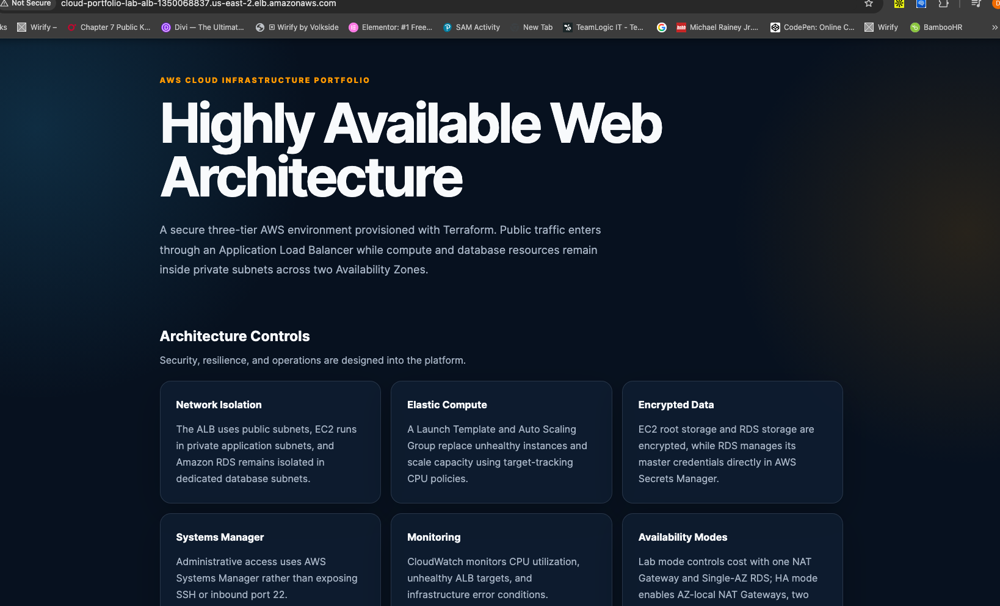
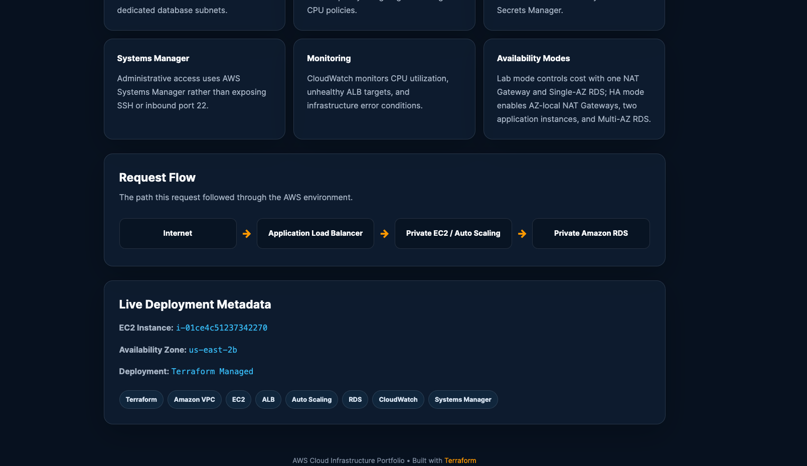
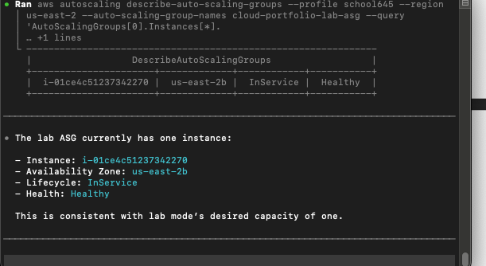
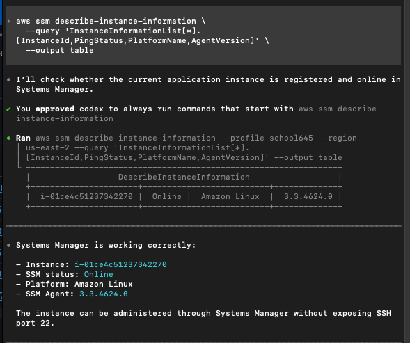
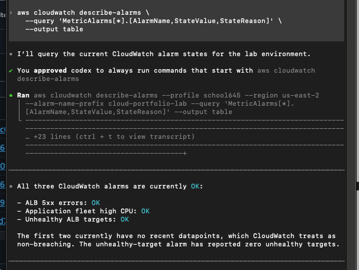

# Highly Available AWS Web Architecture

Terraform portfolio project for a secure, observable three-tier web platform that can scale automatically and tolerate an Availability Zone failure.

> **Project status:** The architecture was deployed and validated in both Lab and HA modes in `us-east-2`, then fully destroyed to stop student-account charges. Terraform destroyed 44 managed resources and the final state is empty. The code remains ready to rebuild.



_Deployed application reached through the public Application Load Balancer. This screenshot records the initial HTTP validation; the repository now includes an optional ACM-backed HTTPS listener and redirect for use with a validated domain._

## What this project demonstrates

| Area | Implementation |
|---|---|
| Availability | Two-AZ subnet design, ALB, Auto Scaling, optional dual NAT Gateways, RDS Multi-AZ |
| Network security | Public edge only; EC2 and RDS remain private; tier-to-tier security-group trust |
| Host security | No inbound SSH, Systems Manager access, IMDSv2 required, encrypted gp3 root volumes |
| Data security | Private encrypted MySQL, RDS-managed credentials, TLS-required database connections |
| Operations | ALB health checks, rolling instance refresh, CPU target tracking, CloudWatch alarms, SNS |
| Cost control | `ha_mode` switches between an economical lab footprint and production-style HA |
| Reproducibility | Versioned Terraform configuration, immutable EC2 bootstrap, documented validation and teardown |

## Architecture

```text
                              Internet
                                  |
                     Application Load Balancer
                       /                    \
              Public subnet AZ1      Public subnet AZ2
                 NAT Gateway 1         NAT Gateway 2 (HA)
                       |                      |
              App subnet AZ1          App subnet AZ2
                 EC2 / ASG               EC2 / ASG
                       \                      /
                    Application security group
                                  |
                         MySQL over TLS/3306
                                  |
                 RDS DB subnet group across two AZs
                     Single-AZ (Lab) / Multi-AZ (HA)
```

The VPC uses `10.20.0.0/21` and preserves unused address space for future endpoints, cache, containers, or internal services.

| Subnet tier | AZ1 | AZ2 | Purpose |
|---|---|---|---|
| Public | `10.20.0.0/27` | `10.20.0.32/27` | ALB and NAT Gateways |
| Application | `10.20.1.0/24` | `10.20.2.0/24` | Auto Scaling EC2 fleet |
| Database | `10.20.3.0/27` | `10.20.3.32/27` | Private RDS subnet group |

Application subnets receive the largest allocation because the horizontally scaled tier has the greatest potential IP demand. Public and database subnets use smaller `/27` ranges appropriate to their expected resource density.

## Request path



The ALB is the only public application entry point. It forwards traffic to private EC2 instances registered by the Auto Scaling Group. RDS accepts MySQL only from the application security group and has no public route or public endpoint.

## Lab and HA modes

The same configuration supports an explicit cost-versus-resilience decision through `ha_mode`.

| Capability | Lab mode (`false`) | HA mode (`true`) |
|---|---|---|
| NAT Gateways | One shared NAT Gateway | One NAT Gateway per AZ |
| ASG capacity | min `1`, desired `1`, max `2` | min `2`, desired `2`, max `4` |
| Application placement | One instance across eligible subnets | At least two instances across both AZs |
| RDS | Single-AZ | Multi-AZ |
| Backup retention | One day | Seven days |
| Enhanced Monitoring | Disabled | 60-second interval |
| Deletion protection | Disabled | Enabled |
| Final snapshot | Skipped for temporary lab | Required |

Lab mode reduces cost but intentionally retains two single points of failure: one application instance and one NAT Gateway. HA mode was deployed and verified with two healthy application instances in `us-east-2a` and `us-east-2b`, two healthy ALB targets, two available NAT Gateways, and `MultiAZ=true` on RDS.

## Security controls

### Trust boundaries

```text
Internet
   | HTTP/HTTPS
ALB security group
   | TCP/80
Application security group
   | TCP/3306
Database security group
```

- No inbound port 22 rule or EC2 public IP is required.
- Systems Manager provides administrative access through the EC2 instance profile.
- Launch Templates require IMDSv2 tokens.
- EC2 root volumes and RDS storage are encrypted.
- RDS manages the master password directly in Secrets Manager.
- EC2 can read only the specific RDS-managed secret referenced by Terraform.
- MySQL uses a custom `mysql8.4` parameter group with `require_secure_transport=1`.
- ALB egress is limited to TCP/80 in the private application CIDRs.
- Application egress is limited to TCP/443 and TCP/3306 in the DB subnet range.
- The database security group has no outbound rule.

### HTTPS readiness

Supplying an issued ACM certificate ARN from the deployment Region enables:

- an HTTPS listener on port 443;
- `ELBSecurityPolicy-TLS13-1-2-2021-06`; and
- a permanent HTTP-to-HTTPS redirect.

```hcl
acm_certificate_arn = "arn:aws:acm:us-east-2:123456789012:certificate/example"
```

The student account had no controlled domain, Route 53 hosted zone, or issued ACM certificate, so the public deployment was validated over HTTP. The HTTPS Terraform path was validated without presenting a self-signed certificate as production evidence.

## Deployment evidence

The following screenshots were captured from the live Lab deployment before teardown.

### Auto Scaling instance health



The Lab ASG maintained one `InService` and `Healthy` instance, consistent with desired capacity `1`. HA validation later proved two healthy instances across both AZs.

### Systems Manager access



The private EC2 instance registered as `Online` with Systems Manager, proving administrative access worked without SSH or inbound port 22.

### CloudWatch alarms



The initial application and ALB alarms reported `OK`. Hardened HA validation later confirmed all five alarms were `OK`, including RDS high CPU and low free storage.

## Observability and scaling

- ASG target tracking maintains average fleet CPU near 50 percent.
- Fleet high CPU uses a 2-of-2 evaluation.
- Unhealthy ALB target detection treats missing data as breaching.
- ALB 5xx errors treat missing data as non-breaching.
- RDS high CPU and low free storage use 2-of-3 evaluation windows.
- HA mode enables RDS Enhanced Monitoring through a dedicated service role.
- Alarm and recovery actions publish to a project SNS topic.

## Immutable application delivery

The Nginx landing page is built by `user_data.sh` through the EC2 Launch Template. Updates follow an immutable rollout:

1. Change and syntax-check `user_data.sh`.
2. Terraform creates a new Launch Template version.
3. The ASG references that explicit version.
4. Instance refresh launches a replacement.
5. The ALB waits for the new target to become healthy.
6. Auto Scaling drains and terminates the old instance.

The landing-page upgrade was deployed with `0 add, 2 change, 0 destroy`; the version-2 target became healthy before the version-1 instance terminated.

## Deploy the project

### Prerequisites

- Terraform `>= 1.5.0`
- AWS CLI authenticated to the intended account
- AWS permissions suitable for the resources in this project
- An issued ACM certificate in `us-east-2` only if enabling HTTPS

### Initialize and validate

```bash
cd /path/to/aws-project-1
export AWS_PROFILE=school645

aws sts get-caller-identity
terraform init
terraform fmt -check
terraform validate
```

Always confirm the returned AWS account before planning or applying.

### Configure Lab mode

Copy the safe example and keep the resulting file local:

```bash
cp terraform.tfvars.example terraform.tfvars
```

```hcl
aws_region   = "us-east-2"
project_name = "cloud-portfolio"
environment  = "lab"
ha_mode      = false
```

### Plan and apply

```bash
terraform plan -out=lab.tfplan
terraform apply lab.tfplan
```

### Upgrade to HA mode

Set `ha_mode = true`, then use a saved plan:

```bash
terraform plan -out=ha.tfplan
terraform apply ha.tfplan
```

Expected HA changes include a second EIP/NAT Gateway, AZ2 route migration, ASG capacity expansion, RDS Multi-AZ, longer backup retention, deletion protection, and Enhanced Monitoring.

## Validation commands

```bash
# ALB targets
aws elbv2 describe-target-health \
  --target-group-arn "$(terraform output -raw target_group_arn)" \
  --query 'TargetHealthDescriptions[*].[Target.Id,TargetHealth.State,TargetHealth.Reason]' \
  --output table

# ASG placement and health
aws autoscaling describe-auto-scaling-groups \
  --auto-scaling-group-names cloud-portfolio-lab-asg \
  --query 'AutoScalingGroups[0].Instances[*].[InstanceId,AvailabilityZone,LifecycleState,HealthStatus]' \
  --output table

# Systems Manager
aws ssm describe-instance-information \
  --query 'InstanceInformationList[*].[InstanceId,PingStatus,PlatformName,AgentVersion]' \
  --output table

# RDS topology
aws rds describe-db-instances \
  --db-instance-identifier cloud-portfolio-lab-mysql \
  --query 'DBInstances[0].[DBInstanceStatus,MultiAZ,StorageEncrypted,PubliclyAccessible,MonitoringInterval]' \
  --output table

# Configuration convergence
terraform plan -detailed-exitcode
```

## Repository layout

| File | Responsibility |
|---|---|
| `versions.tf` | Terraform and provider constraints |
| `providers.tf` | AWS provider and default tags |
| `variables.tf` / `locals.tf` | Inputs, validation, naming, common tags |
| `networking.tf` | VPC, subnets, routes, Internet/NAT Gateways |
| `security_groups.tf` | Tier boundaries and egress restrictions |
| `iam.tf` | EC2/SSM and RDS monitoring roles |
| `load_balancer.tf` | ALB, target group, HTTP/optional HTTPS listeners |
| `compute.tf` / `user_data.sh` | Launch Template, ASG, immutable bootstrap |
| `database.tf` | RDS, subnet group, TLS parameter group |
| `monitoring.tf` | Scaling policy, CloudWatch alarms, SNS |
| `outputs.tf` | Deployment endpoints and resource identifiers |
| `docs/session-notes-2026-08-21.md` | Full implementation, validation, troubleshooting, and teardown record |

## Cost and teardown

NAT Gateways, public IPv4 addresses, ALB, EC2/EBS, RDS, Secrets Manager, CloudWatch, and data transfer can incur charges. Lab mode reduces but does not eliminate cost.

If HA mode is active, first return to Lab mode so RDS deletion protection is disabled:

```bash
terraform apply -var="ha_mode=false"
terraform destroy -var="ha_mode=false"
terraform state list
```

The final project teardown destroyed 44 resources. Follow-up AWS inventory checks returned no NAT Gateways, EIPs, ALBs, ASGs, active EC2 instances, RDS instances/snapshots, project VPCs, alarms, SNS topics, or project IAM roles.

Do not commit `terraform.tfstate`, `terraform.tfstate.backup`, `terraform.tfvars`, or saved plan files. This repository's `.gitignore` excludes them.

## Production hardening roadmap

- Manage public DNS in Route 53 and automate ACM DNS validation.
- Add AWS WAF managed rule groups and ALB access logging.
- Replace NAT-based AWS API access with appropriate VPC endpoints.
- Use customer-managed KMS keys with scoped key policies.
- Add RDS connection, latency, event, and failover alarms from workload baselines.
- Enable Session Manager session logging, CloudTrail, AWS Config, GuardDuty, and Security Hub.
- Add CI validation, linting, policy-as-code, and OIDC-based AWS authentication.
- Move Terraform state to an encrypted, versioned remote backend with locking.

## Detailed engineering record

See [the complete session notes](docs/session-notes-2026-08-21.md) for commands, observed outputs, design decisions, troubleshooting, Git milestones, HA proof, and final teardown evidence.
